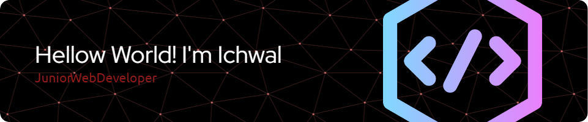

## Hi! I'm Ichwal 👋

---
### Os
  

### Skills
        

### Contact With me
  

---
### My Github Status

---
###

### 🏆 GitHub Trophies

###
---

>
###
---
<!--
**ichwalM/ichwalM** is a ✨ _special_ ✨ repository because its `README.md` (this file) appears on your GitHub profile.

Here are some ideas to get you started:

- 🔭 I’m currently working on ...
- 🌱 I’m currently learning ...
- 👯 I’m looking to collaborate on ...
- 🤔 I’m looking for help with ...
- 💬 Ask me about ...
- 📫 How to reach me: ...
- 😄 Pronouns: ...
- ⚡ Fun fact: ...
-->
