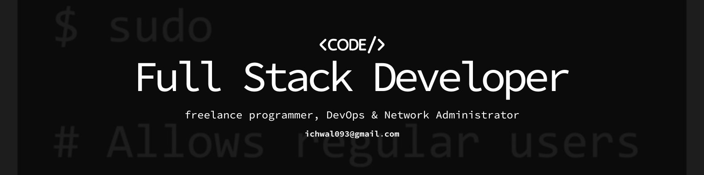

## Hi! I'm Ichwal 👋

---
### Os
  

### Skills
        

### Contact With me
  

---
## 📊 GitHub Stats & Activity

  
  

 

  

 

### 🐍 GitHub Contributions Snake

*Sssttt... This snake eats my commit history!* 🐍

  <picture>
    <source media="(prefers-color-scheme: dark)" srcset="https://raw.githubusercontent.com/ichwalM/ichwalM/output/snake.svg">
    <source media="(prefers-color-scheme: light)" srcset="https://raw.githubusercontent.com/ichwalM/ichwalM/output/snake.svg">
    
  </picture>

